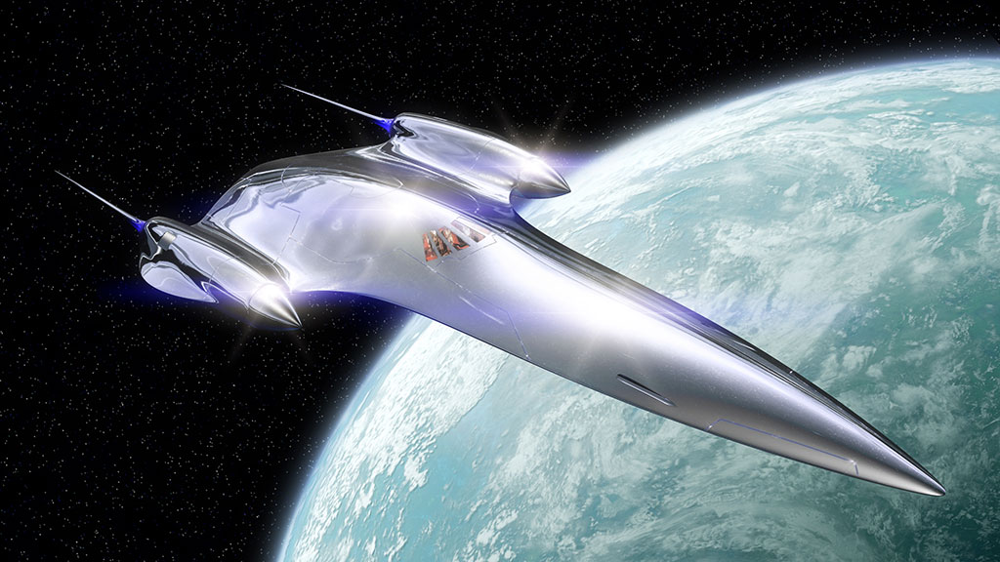

# Cosmos: A live commentary

I recently downloaded the first few episodes of [the *Cosmos* reboot that launched in the USA in March](https://en.wikipedia.org/wiki/Cosmos:_A_Spacetime_Odyssey). In the spirit of scientific documentation, here are some tasting notes from the first episode.

**“The cosmos is all that is, or ever was, or ever will be.”**

It’s only fitting that we start with Sagan’s opening lines from [the original series](https://en.wikipedia.org/wiki/Cosmos:_A_Personal_Voyage). The implication is clear: this is a loving remake, not a revolution. I’m told whole swathes of this series are almost shot-for-shot remakes of the original. And who’s to blame them? Carl Sagan’s original series has a cult following. It was a blessed relief from simmering Cold War relations across the globe, and a gentle reminder that the universe was much older and much wider than the squabbling bunch of apes that happened to currently occupy the planet’s surface.

This time, in Sagan’s place, we have Neil deGrasse Tyson, who, as the closing titles reveal, has a very personal reason for assuming the Cosmos mantle.

He continues the introduction with a barrage of paradoxes – “Explore the planets of stars that never die, discover atoms as massive as suns, and universes smaller than atoms” – while wandering around the same wind-swept shoreline as Carl in the original series.

**01:01** Sci-fi trope ahoy! Extreme close-up of wide-eyed baby, looking up at stars, to symbolise both man’s childlike wonder at—and insignificance in the face of—the universe. *How original.*

**02:00** Tyson’s halfway through explaining the scientific method, when, suddenly, he’s inside a weird shiny silver pod. It swoops around, elongates into a tear-drop and disappears into the stars.

It’s the “Ship of the Imagination.” But given its uncanny resemblance to [Amidala’s starship](http://starwars.wikia.com/wiki/J-type_327_Nubian_royal_starship), you’d be forgiven for thinking you’d accidentally switched into a re-run of the Phantom Menace.

In the original series, Sagan’s ship was a glowing dandelion seed of light, “drawn by the music of cosmic harmonies” (yes, this was the late 70s). MacFarlane clearly felt the need to update it with a more Hollywood aesthetic. But I wonder, if this had been a British re-make, whether we’d have dropped the ship entirely? In a program full of rock-solid facts, the whole ship conceit seems ridiculous, and indeed, by halfway through, they’ve forgotten it entirely, only to return in the minute before the closing titles.

**02:18** The titles are straight out of Star Trek. We begin zooming over a rocky lunar surface, through crags and canyons shrouded in mysterious fog. We swoop and tilt as a 100% American bugle imparts pangs of military nationalism for the target audience. Even the the typeface is straight from Star Trek, swishing in with a lens flare animation, set in all caps, hovering over the landscape in patent [sci-fi user-interface blue](http://99percentinvisible.org/episode/future-screens-are-mostly-blue/).

The lunar crater becomes an eye. I suddenly notice we’ve switched to 2.40∶1 – cinematic widescreen. The whole thing oozes big-screen polish. The Silver Surfer ship swoops towards the horizon of a planet on which the sun is only just rising. As the bugles give way to flutes, universes turn into seashells, into dandelions, into satellites, into DNA helixes. Twinkly piano music plucks at your heart strings then gives way to a full orchestral swell. They’re seriously going to town on this stuff – hope the rest of the episode lives up to it.

**04:01** We may be in a science documentary, but that doesn’t stop the FX department putting [gratuitous Swooooooosh sound effects](http://www.tested.com/science/space/459215-what-if-sound-star-wars-was-type-interface-design) into all the space scenes. Oh well.

**04:11** It’s said MacFarlane was such a Star Trek geek, he smuggled himself into a [cameo role](http://www.imdb.com/character/ch0111446/) in the ill-fated early 2000s TV reboot. Maybe that’s also why he’s put Tyson on what appears to be the bridge of the Enterprise for most of this intro…

While Tyson gives us a tour of the solar system, my mind wanders enough to notice the logo in the bottom corner. Anybody else find it bizarre that this show airs on the [ultra-closed-minded Fox network?](https://en.wikipedia.org/wiki/Fox_News_Channel_controversies)

**10:00** Tear Jerker Moment #1 – leaving Voyager 1 far behind, with some echoey, warbly, old-timey music playing on an imaginary record deck. Extra marks for the juxtaposition between Voyager’s Meccano aesthetic, and the silver-surfer hull of Tyson’s ship.

**12:00** Whoa, awesome, invisible “rogue” planets with oceans under a frozen surface. “Who knows what might be swimming there…” rumbles Tyson’s trademark film-trailer-voiceover-guy baritone. Tingly tappy sci-fi music reminds us this is all complete speculation, but, hey, isn’t it cool?

**13:07** Oh, speaking of typefaces from the credits – they’ve made an odd choice for the “cosmic address” scenes…

I get that they’ve gone with a sort of humanist, sort of classical, all-caps face. Maybe they’re trying to reference the decidedly seventies type in the original series. But it feels like the guys who did the titles, and the guys who did the in-show graphics, should have swapped notes. A thin, futuristic typeface like the one used during the title sequence would have complemented the black spacey imagery and the Silver Surfer spaceship better. As it stands, the type ends up making the whole segment feel like a slightly dog-eared, pastel-shaded science textbook from the 80s.

**16:40** Once Tyson’s journey out to the limit of the universe is over, we drop back into orbit around Earth. Tyson nips down to some crumbling Italian back street, [Brian Cox styley](http://www.itsokaytobesmart.com/post/14902783395/doubleheelix-how-a-sandcastle-reveals-the-end), for a tenuous segway into a really awesome little animation about an Italian monk. What is it with science programs and dropping presenters into random foreign locations? Neil, get back in your ship.

**25:30** Tear Jerker Moment #2 – poor old incarcerated heretic Giordano Bruno (yeah, I’d [never heard of him either](https://en.wikipedia.org/wiki/Giordano_Bruno)) is magically restored to youth as he escapes the confines of his cell and floats around the cosmos, only to be barbarically burned at a stake a few minutes later. People are bad.

**27:25** The “Cosmic Calendar” graphics are to-die-for. Really slick. Like a universal-scale iPhone Weather app, complete with punchy Futur-a-like typeface. The burning aura of the Big Bang hovers above January. Comets and nebulae glisten over June. Earth’s oceans fill in November, and life begins to bloom in in late December.

It’s gorgeous. And when you think about it, a rather clever way of making imaginable an unimaginably long process. If there’s one let-down, it’s that—with Neil prancing around on the calendar—the whole thing inherits this slightly fake [holo-deck sort of feel](https://twitter.com/neiltyson/status/463122781874716672). But it’s worth it, and soon forgotten as Tyson draws us though billions of years of gorgeously rendered “star stuff.”

**34:20** The obligatory climate change reference. At least they kept it short. I have a feeling it’s only a taste of lectures yet to come.

**34:48** Good God, Tyson looks sexy as he nonchalantly pops his jacket collar with a shrug and braces for meteor impact.

**36:20** Once we change scale to explore the last few seconds of the cosmic calendar, I get really confused. Has the length of the year changed? Are we now on a different timescale, where the Big Bang is some multiple of years away? If not, and the timescale hasn’t changed—which is what I *think* has happened—then what’s all the “need to change scale” stuff about? It’s just confusing.

**40:10** As the episode draws to a close, we return to the blustery coastline of the opening. I get the feeling they’ve run out of things to say, so we get a little obituary piece on Carl Sagan and his astonishing combover for five minutes. I’ll let them off though, because Neil gets to shoehorn his own life story in, with the aid of a conspicuously empty-looking diary, giving the episode Tear-Jerker Moment #3 – Neil deGrasse Tyson’s boyhood memories of a snowy day with his hero in Ithaca.

---

As it turns out, Neil gets to repeat his Carl Sagan encounter a number of times through the series. Just like the original series’ title, this remake is clearly a very “personal journey” for Tyson. It’s sort of cute seeing him share some of the delight and wonder that made him an astrophysicist in the first place. And then you realise that’s what the whole episode has been about: the wonder and awe of this massive celestial machine, from the perspective of a child.

The clues have been sewn all through the episode – the attractive computer graphics, the approachable introduction to the solar system, the animations, and the frenetic pace. The whole thing has clearly been made for kids, in a way that the Americans do so much better than anyone else. Tyson’s delivery might feel dry and scripted at times, but it has just the right measures of teacherliness, inquisitveness, and friendly warmth to make it ideal for guiding a new generation of kids through the universe and maybe, just maybe, into a lifetime of their own scientific discoveries.

If just one new kid becomes a scientist after watching this show, then it’s done its job. And in a TV ecosystem full of vapid dramas and scripted laughs, I wish it the best of luck.

<link href="/post/teaching-everyone-to-hack">
<link href="/post/unfortunate-exclusivity-of-art">
